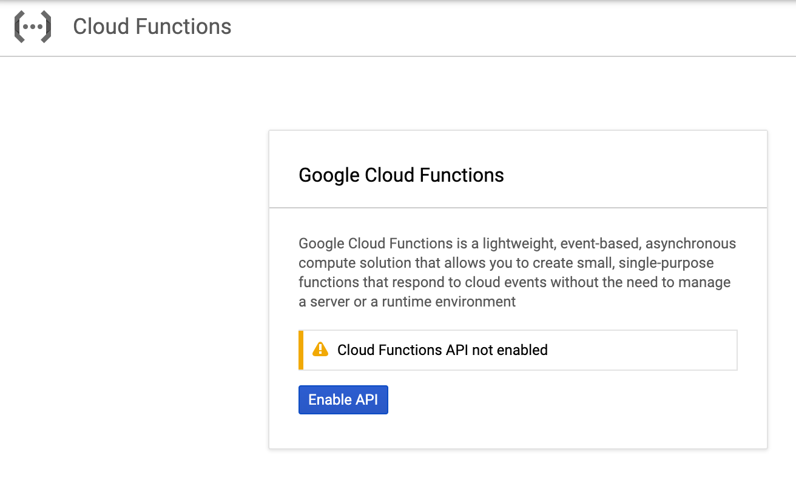
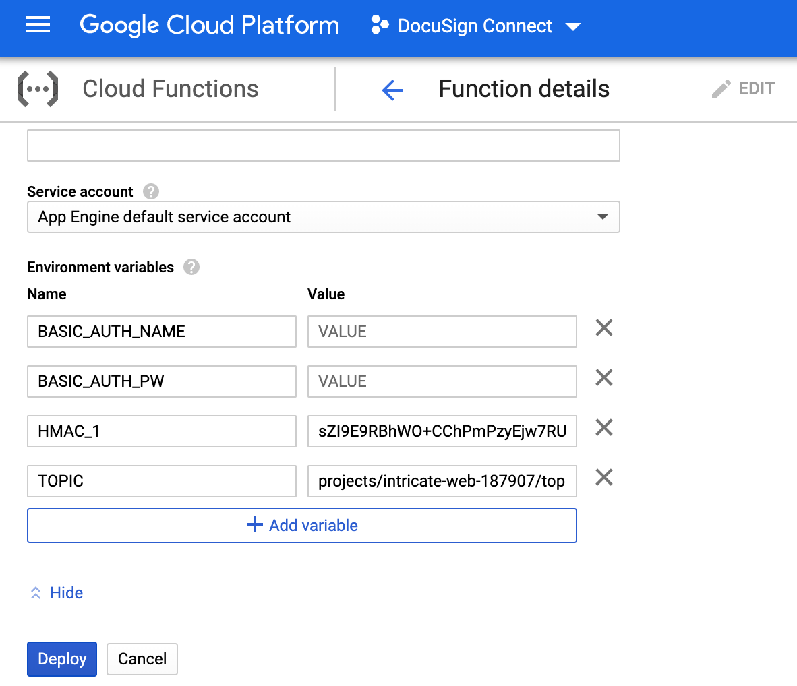

# Provision the Cloud Function

#### Summary
At the end of this article, you will have recorded the 
Google Cloud Function's `Trigger URL`.

The Trigger URL will be used when you create the 
DocuSign Connect subscription (configuration).
The URL can also be used as an `EventNotification` setting
if you want to add a webhood to a specific envelope 
created via the API.

#### Steps
1. Open the 
   [Google Cloud Functions](https://cloud.google.com/functions/)
   page.
1. Click the **View Console** button.
1. Click the **Enable API** button in the Cloud Functions 
   console to enable Cloud Functions for your account. 
   See figure 1, below.

   
   Figure 1. Click **Enable API**

1. Click **Create function** as shown in 
   figure 2.

   
   Figure 2. Click **Create Function**
1. You will be asked to choose a name for the function.
   Then complete the Cloud Function form. See figure 3.
   
   
   Figure 3. Complete the Cloud Function form.

1. Note that since we updated the form's 
   **Function to execute** field, we also needed to
   update soure line 7 to the same name.

1. Note the `URL` field on the form. This is the URL
   for your function. Make a note of it for use when
   you set up the Connect subscription and for 
   testing. 

1. Click **Create** to create your function
   with a default Node.js script.

1. You will be returned to the Cloud Function list of
   functions as shown in figure 4. Your new function will
   be listed.

   
   Figure 4. Function list.

   You can now test the default Hello World function
   by using a browser.

1. Update the function's index.js and package.json 
   files by using the **Source** tab for the function.
   Click on your function's name in the
   function list. Then click the **Source** tab.

   Use the source files in this repository: 
   [index.js](../connectListener/index.js)
   and 
   [package.json](../connectListener/package.json)

   Alternatively, you can edit your
   files locally and then upload them
   to Google Cloud. The 
   [upload.sh](../upload.sh) script 
   may be of help. It is used with the
   [GCloud Command Line tool](https://cloud.google.com/sdk/gcloud/).
   Also see the tool's 
   [Quickstart documentation](https://cloud.google.com/sdk/docs/quickstarts).

1. In the next steps, you will set the Environment
   Variables for the function using the 
   console. 
   
   There are multiple
   techniques for setting the environment variables.
   
   You can set them via the console as shown below. 
   You can also set them via a `.env.yaml`
   file that you upload from your development machine.
   See the
   [ENV.yaml](../ENV.yaml)
   file as an example and its use in the 
   [upload.sh](../upload.sh) script.

1. Open the Functions console and click on your
   function's name. The Functions details screen
   will be shown. 

   Click the **Edit** link at the top of the page.

   Click the **More** link at the bottom of the
   page, just above the **Deploy** button.

   The page will expand to show additional 
   settings.

   Scroll down to the **Environment variables**
   section and fill in the settings as shown in 
   figure 5.

   Remember to click **Deploy** after using the 
   console to make changes.

   
   Figure 5. The function's environment
   variables settings.

1. If you forget the URL for the Cloud Function,
   click on your function's name in the
   function list. Then click the **Trigger** tab as
   shown in figure 6. 

   
   Figure 6. The function's trigger settings.

## Next steps

### Configure your Connect subscription
Refer to the Connect documentation for information
on configuring the Connect subscription.

Note that the Connect subscription must not
include the envelopes' documents nor
Certificates of Completion in the notification 
messages.

### Create and configure your worker application
You can use any software stack and any 
language. See the 
[Subscriber overview](https://cloud.google.com/pubsub/docs/subscriber) 
for more information.

For an example worker application, see
the [connect-node-worker-gcloud](../../connect-node-worker-gcloud)
repository.
